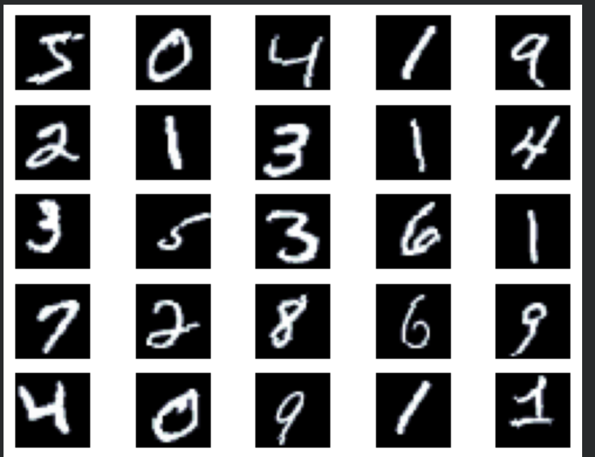
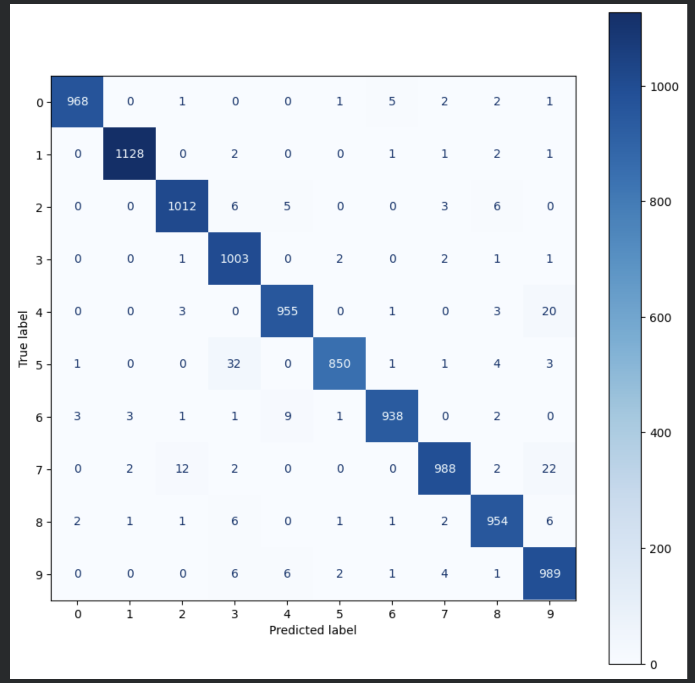
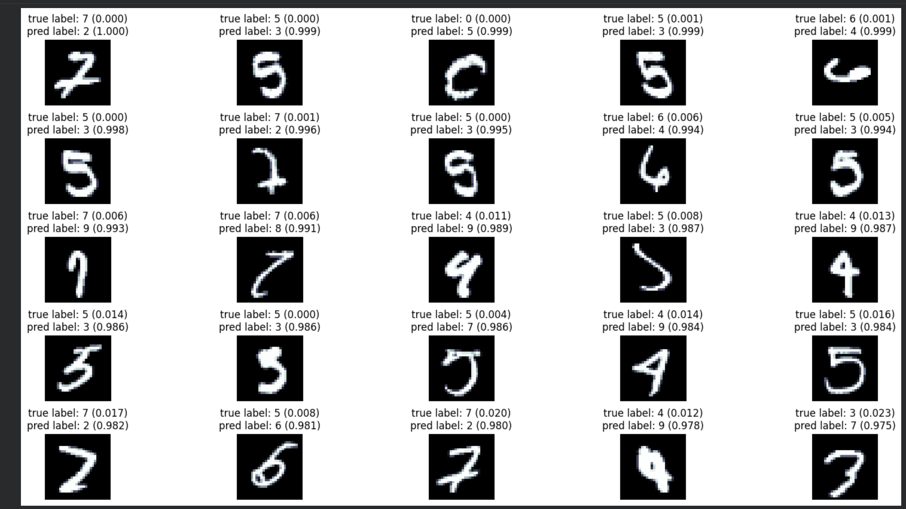

# MNIST Digit Classification — MLP Neural Network

A Multi-Layer Perceptron (MLP) built from scratch in PyTorch to classify
handwritten digits from the MNIST dataset. Goes beyond basic training —
includes PCA/t-SNE visualisation, wrong prediction analysis, and confusion matrix.

---

### What it does

- Builds and trains a 3-layer MLP on 60,000 MNIST training images
- Applies data augmentation — random rotation and random crop with padding
- Splits data into train/validation/test sets for honest evaluation
- Evaluates using accuracy, loss curves, and full confusion matrix
- Visualises wrong predictions with confidence scores
- Uses PCA and t-SNE to visualise how the network represents digit classes internally

---

### Dataset

MNIST — downloaded automatically via torchvision
- 60,000 training images
- 10,000 test images
- 10 classes (digits 0–9)
- Image size: 28×28 grayscale

---

### Architecture
Input (784 = 28×28 flattened)
→ Linear(784 → 250) + ReLU
→ Linear(250 → 100) + ReLU
→ Linear(100 → 10)
→ CrossEntropyLoss

---

### Training Setup
Optimizer     : Adam (default lr)
Loss          : CrossEntropyLoss
Batch size    : 64
Augmentation  : RandomRotation(5°) + RandomCrop(28, padding=2)
Validation    : 10% of training set held out

---

### Results

| Split | Size |
|---|---|
| Train | 54,000 |
| Validation | 6,000 |
| Test | 10,000 |

---

### Visualisations

**Sample training images (after augmentation):**



**Confusion Matrix:**



**Wrong predictions with confidence scores:**



---

### Stack

| | |
|---|---|
| **Framework** | PyTorch |
| **Data** | torchvision · MNIST |
| **Evaluation** | scikit-learn (metrics, decomposition, manifold) |
| **Visualization** | Matplotlib · tqdm |
| **Language** | Python |

---

### Setup

```bash
pip install torch torchvision scikit-learn matplotlib tqdm

jupyter notebook Neural_Network_Digit_Classifiction.ipynb
```

---

### How to Add Images

After running the notebook, save the output plots:
1. Run all cells in the notebook
2. Right-click each plot → Save image
3. Create an `images/` folder in the repo
4. Upload: digit_samples.png, digit_confusion_matrix.png, digit_wrong_predictions.png
